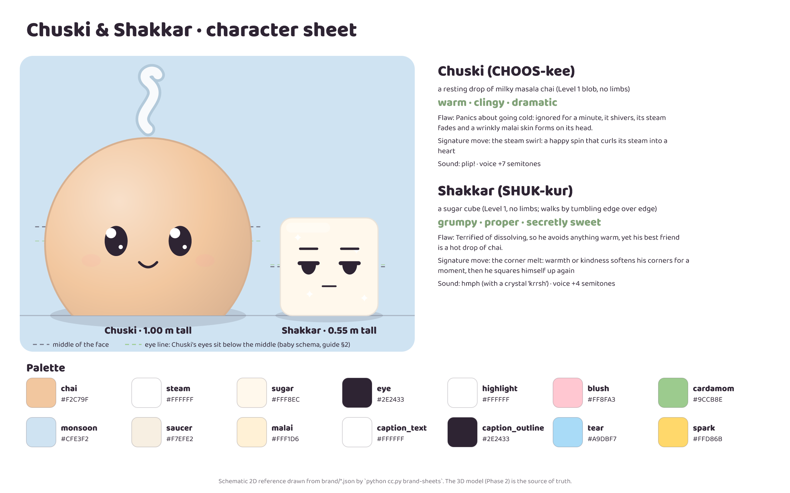

# Chuski · brand one-pager (2-minute read)

**Who:** **Chuski** (CHOOS-kee, "a sip"), a round drop of milky masala chai with a curl of steam
for an eyebrow. *Warm · clingy · dramatic.* It's terrified of going cold (a sad malai skin forms on its
head) and of the microwave. Signature move: the **steam swirl**, which curls its steam into a heart.
Says only "plip!".

**With:** **Shakkar**, a grumpy sugar cube. *Grumpy · proper · secretly sweet.* He dissolves when
hugged, and his best friend is a hot drop of chai. He walks by tumbling edge over edge.

**Where:** a rainy kitchen windowsill in an Indian flat: a cutting-chai glass, a saucer, a sugar
jar, a steel spoon and a money plant. Monsoon-blue backdrop.

**Why it can work:** chai is in every Indian day (alarms, office breaks, guests, exams, rain), but
3D chai *characters* are rare. A liquid hero makes squash, stretch, melting and splitting
physically funny. A hug that dissolves your best friend is an endless gag engine.

**Look:** chai `#F2C79F` · sugar `#FFF8EC` · eyes `#2E2433` (never pure black) · blush `#FF8FA3`
· accent cardamom `#9CCB8E` · background monsoon `#CFE3F2`.

**Name and handle:** **Chuski · the chai drop**. First choice `@chuski.the.chai`, then
`@chuski.chai`, `@chuski.and.shakkar`, `@chuski.animated`, `@heychuski`. **You check
availability** (task H03).

**Bio:** *Chuski ☕ a drop of chai who hates going cold · with Shakkar, a grumpy sugar cube ·
animated character · new episode every Saturday*

**Schedule:** one episode **every Saturday**, starting once three are finished in reserve (target
**14 Nov 2026**). Optional Wednesday loop or behind-the-scenes clip. Your time: about 1–2 h/week.

**Rotation:** relatable → duo → interactive/food → trend/loop/BTS, with festivals overriding
(planned 2 weeks ahead in `growth/calendar.csv`).

**First three posts:** *Too Hot to Hug* (the hug that melts him) · *Five More Minutes* (melting to
dodge the alarm) · *How Many Sugars?* (pause to pick). All 12: [FIRST_12_EPISODES.md](FIRST_12_EPISODES.md).
75 more ideas: `growth/idea_bank.csv`.

**Never:** real brands, religious or political jokes, stereotypes, body or diet shaming, toddler
themes, baked-in licensed music, more than 5 hashtags, or undisclosed sponsorships
([decision 006](../decisions/006-voice-captions-hashtags.md)).

**Veto anything:** comment `veto: <why>` on the Phase 1 PR. I'll re-decide and update every file.

More: [expressions](sheets/expressions.png) · [turnaround](sheets/turnaround.png) ·
[thumbnail test](sheets/thumbnail_test.png) · decisions [001](../decisions/001-character.md)
[002](../decisions/002-sidekick.md) [003](../decisions/003-world.md)
[004](../decisions/004-name-and-handles.md) [005](../decisions/005-content-strategy.md)
[006](../decisions/006-voice-captions-hashtags.md)
